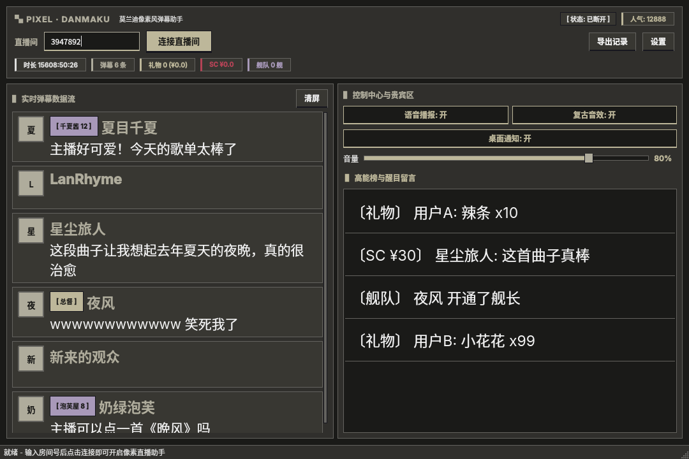

<div align="center">

# Bilibili Pixel Danmaku

莫兰迪像素风 B 站直播弹幕助手，PySide6 桌面应用

</div>



## 特性

- 实时监听 B 站直播间弹幕、礼物、醒目留言（SC）、大航海
- 可选 Cookie 鉴权，解除未登录连接限制，高频弹幕零遗漏
- 莫兰迪主题随壁纸动态同步（由 morandi-gen.py 生成配色）
- Edge-TTS 中文语音播报，多音色与自定义播报模板
- 程序实时合成 8-Bit 复古音效（送礼、升级、SC）
- Linux 原生桌面通知（notify-send），支持头像图标展示
- 弹幕、礼物、高能榜面板字号与头像大小可调
- 关键词屏蔽、弹幕记录一键导出 CSV
- 弹幕头像异步下载与本地缓存

## 环境要求

- Python 3.10+
- Linux 桌面环境（通知功能依赖 notify-send）

## 安装

```bash
python3 -m venv .venv
source .venv/bin/activate
pip install PySide6 aiohttp edge-tts
```

## 使用

```bash
./run.sh
```

填写直播间房间号，点击「连接直播间」即可

## 配置

配置文件位于 `~/.config/bilibili-pixel-danmaku/config.json`

| 分组 | 说明 |
| ------ | ------ |
| bilibili_cookie | B 站登录 Cookie，提升连接稳定性 |
| tts | 语音播报开关、音色、播报模板 |
| audio | 8-Bit 音效开关与音量 |
| notification | 桌面通知开关与停留时间 |
| filter | 屏蔽关键词列表 |
| ui | 弹幕字号、头像大小、高能榜字号 |

## 目录结构

```
core/    B 站 WS 客户端、配置管理、莫兰迪主题、音效、TTS、通知
ui/      主窗口、像素风组件、设置对话框
```

## 功能演示

| 弹幕 | 礼物 | 醒目留言 | 大航海 |
|------|------|----------|--------|
| 滚动展示 + 头像 | 金色色条卡片 | 玫红色条卡片 | 紫色列表项 |

所有界面元素均使用莫兰迪低饱和配色，直角像素风格
